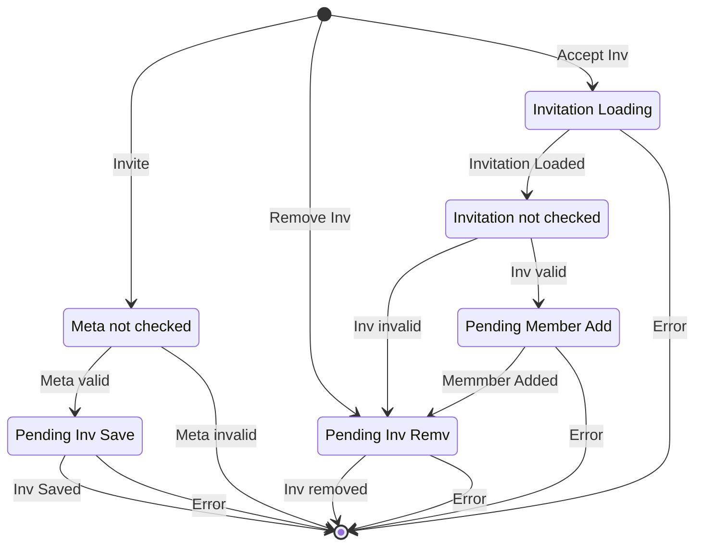

```mermaid
stateDiagram-v2
    
    UnkMeta: Meta not checked
    UnkInv: Invitation not checked
    PendInv: Pending Inv Save
    PendInvRemv: Pending Inv Remv
    PendMemberAdd: Pending Member Add
    PendInvLoad: Invitation Loading
    [*] --> UnkMeta : Invite
    [*] --> PendInvRemv : Remove Inv
    [*] --> PendInvLoad : Accept Inv
    PendInvLoad --> UnkInv : Invitation Loaded
    PendInvLoad --> [*] : Error
    UnkMeta --> PendInv : Meta valid
    UnkMeta --> [*] : Meta invalid
    UnkInv --> PendInvRemv : Inv invalid
    UnkInv --> PendMemberAdd : Inv valid
    PendInvRemv --> [*]: Inv removed
    PendInvRemv --> [*]: Error
    PendMemberAdd --> PendInvRemv: Memmber Added
    PendMemberAdd --> [*]: Error
    PendInv --> [*] : Inv Saved
    PendInv --> [*] : Error
```
