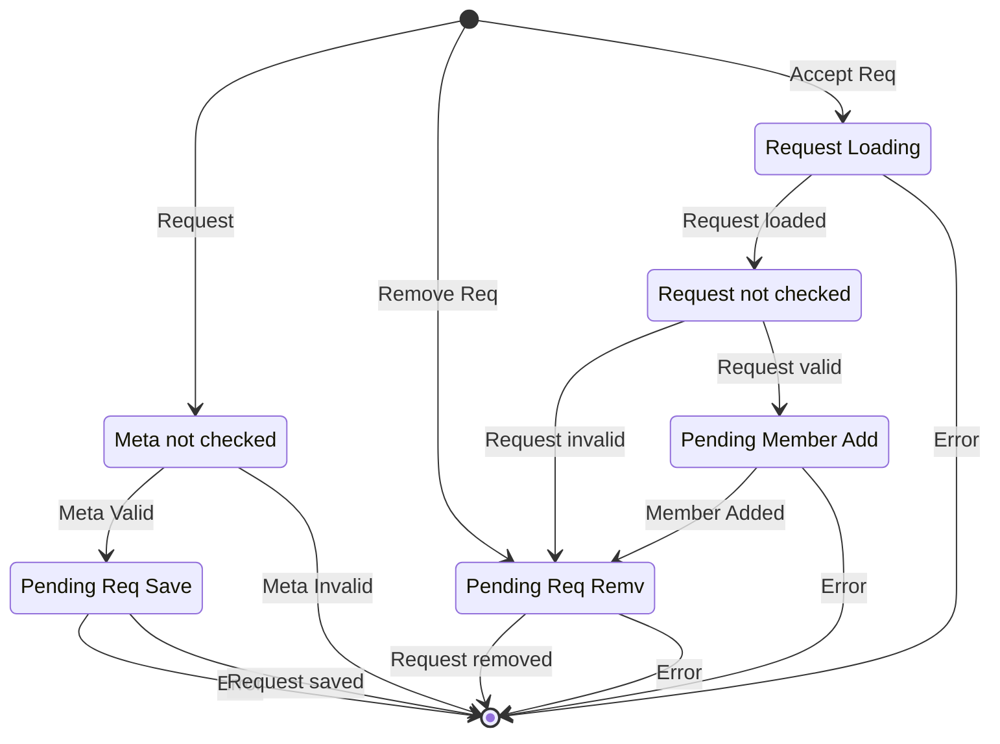

```mermaid
stateDiagram-v2
    UnkMeta: Meta not checked
    UnkReq: Request not checked
    PendReq: Pending Req Save
    PendReqRemv: Pending Req Remv
    PendMemberAdd: Pending Member Add
    PendReqLoad: Request Loading
    [*] --> UnkMeta : Request
    [*] --> PendReqRemv : Remove Req
    [*] --> PendReqLoad : Accept Req
    
    UnkMeta --> PendReq : Meta Valid
    
    UnkReq --> PendReqRemv : Request invalid
    UnkReq --> PendMemberAdd : Request valid
    
    PendReqLoad --> UnkReq : Request loaded
    
    
    PendMemberAdd --> PendReqRemv : Member Added
    PendMemberAdd --> [*] : Error
    PendReq --> [*] : Error
    PendReqLoad --> [*] : Error
    PendReq --> [*] : Request saved
    UnkMeta --> [*] : Meta Invalid
    
    
    PendReqRemv --> [*] : Request removed
    PendReqRemv --> [*] : Error
```
