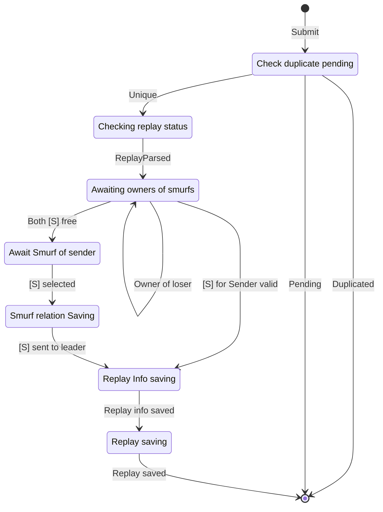

```mermaid
stateDiagram-v2

    DupPending: Check duplicate pending
    CheckingStatus: Checking replay status
    AwaitSaveReplay: Replay saving
    AwaitSmurfSender: Await Smurf of sender
    AwaitSaveRelation: Smurf relation Saving
    AwaitSaveRepInfo: Replay Info saving
    AwaitOwnersOfSmurfs: Awaiting owners of smurfs
    [*] --> DupPending : Submit
    DupPending --> CheckingStatus : Unique
    DupPending --> [*] : Duplicated
    DupPending --> [*] : Pending
    CheckingStatus --> AwaitOwnersOfSmurfs : ReplayParsed
    AwaitOwnersOfSmurfs --> AwaitOwnersOfSmurfs : Owner of winner
    AwaitOwnersOfSmurfs --> AwaitOwnersOfSmurfs : Owner of loser
    AwaitOwnersOfSmurfs --> AwaitSaveRepInfo : [S] for Sender valid
    AwaitOwnersOfSmurfs --> AwaitSmurfSender : Both [S] free
    AwaitSaveReplay --> [*] : Replay saved
    AwaitSaveRelation --> AwaitSaveRepInfo : [S] sent to leader
    AwaitSaveRepInfo --> AwaitSaveReplay : Replay info saved
    AwaitSmurfSender --> AwaitSaveRelation : [S] selected
```
