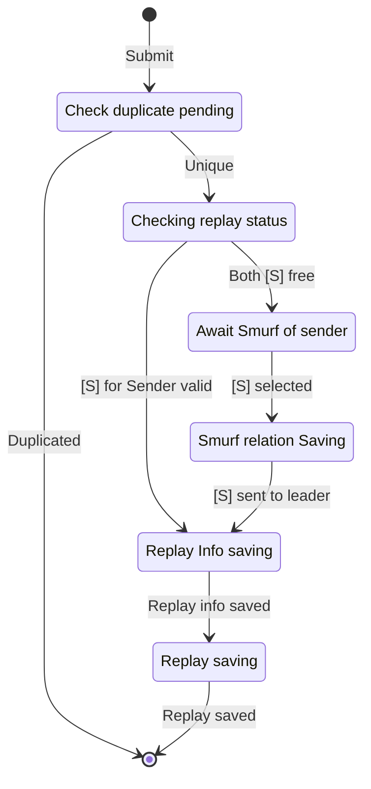

```mermaid
stateDiagram-v2

    DupPending: Check duplicate pending
    CheckingStatus: Checking replay status
    AwaitSaveReplay: Replay saving
    AwaitSmurfSender: Await Smurf of sender
    AwaitSaveRelation: Smurf relation Saving
    AwaitSaveRepInfo: Replay Info saving
    [*] --> DupPending : Submit
    DupPending --> CheckingStatus : Unique
    DupPending --> [*] : Duplicated
    CheckingStatus --> AwaitSaveRepInfo : [S] for Sender valid
    CheckingStatus --> AwaitSmurfSender : Both [S] free
    AwaitSaveReplay --> [*] : Replay saved
    AwaitSaveRelation --> AwaitSaveRepInfo : [S] sent to leader
    AwaitSaveRepInfo --> AwaitSaveReplay : Replay info saved
    AwaitSmurfSender --> AwaitSaveRelation : [S] selected
```
